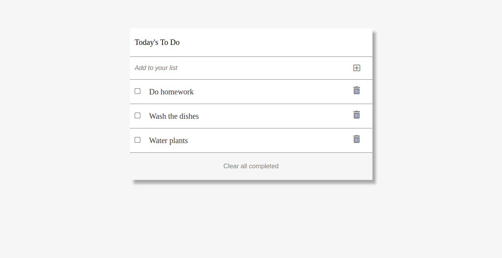

# To-do App

A simple to do list Application which dynamically renders a tasks in JavaScript using the Webpack. Projects and tasks can be created and stored in Web browser's local storage.

## Built With

- JavaScript
- HTML
- Webpack

## Demo

## Getting Started

To set up a local copy of the project

- git clone https://github.com/ShoiraTa/To-Do-List.git

- cd Todo-app

- Run npm install on the terminal to install dependancies

- Run npm start to bundle the files in the src folder & product ouput in dist folder

or

- Go to the dist folder and open index.html

👤 **Shoira**

- GitHub: [@githubhandle](linkedin.com/in/shoira-tashpulatova-bab4a7122)
- Twitter: [@twitterhandle](https://twitter.com/Shoira03)
- LinkedIn: [LinkedIn](https://www.linkedin.com/feed/)

## Show your support

Give a ⭐️ if you like this project!

## 📝 License

This project is [MIT](lic.url) licensed.
